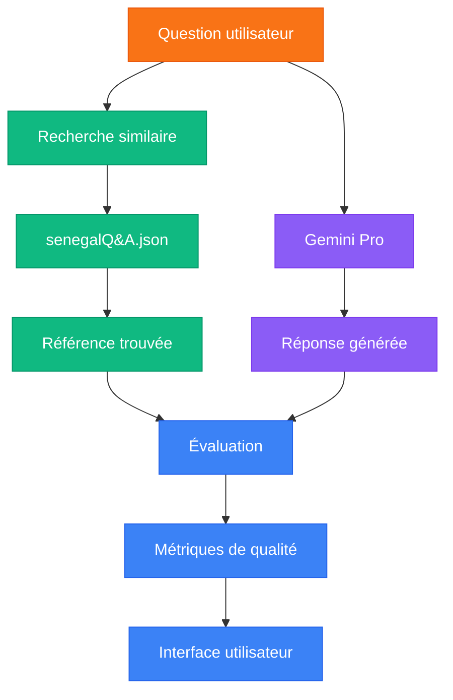

# Système RAG pour Senegal Stats

<div class="text-orange-400 text-4xl font-bold mt-4 mb-8">
  Évaluation systématique des réponses du LLM
</div>

<div class="pt-10 text-lg">
  <div class="bg-orange-500 text-white px-4 py-2 rounded-lg inline-block">
    Chaque réponse évaluée grâce à une référence dans senegalQ&A.json
  </div>
</div>

<!--
Cette présentation explique notre système RAG (Retrieval-Augmented Generation) qui évalue 
systématiquement chaque réponse générée par notre LLM en la comparant à une réponse de référence.

Le principe fondamental est simple : pour chaque question posée par l'utilisateur, nous recherchons
une question similaire dans notre base de données senegalQ&A.json. La réponse associée à cette question
devient alors notre "gold standard" contre lequel nous mesurons la qualité de la réponse générée par le LLM.

Cette approche nous permet d'évaluer objectivement la performance du modèle et d'offrir aux utilisateurs
un moyen transparent de vérifier la fiabilité des informations fournies.
-->

---
layout: section
---

# Architecture du système d'évaluation

<!--
Dans cette section, nous allons voir comment chaque réponse du LLM est systématiquement 
évaluée en la comparant à sa référence correspondante extraite de notre base de données.
-->

---
layout: two-cols
---

# Processus d'évaluation

<div class="mr-10">

## Approche systématique

<ul class="space-y-4 text-lg mt-6">
  <li><strong class="text-blue-500">Pour chaque question</strong> posée par l'utilisateur</li>
  <li><strong class="text-green-500">Une référence</strong> est extraite de senegalQ&A.json</li>
  <li><strong class="text-purple-500">Chaque réponse du LLM</strong> est évaluée par rapport à sa référence</li>
  <li><strong class="text-orange-500">Les métriques calculées</strong> indiquent la qualité de la réponse</li>
</ul>

</div>

::right::

<div class="pl-8 flex items-center justify-center h-full">

## Flux de données



</div>

<!--
Le diagramme illustre clairement notre processus d'évaluation systématique:

1. Pour CHAQUE question posée par un utilisateur, deux processus parallèles sont déclenchés:
   - Le LLM (Gemini Pro) génère une réponse basée sur ses connaissances
   - Le système recherche dans senegalQ&A.json une question similaire

2. L'étape cruciale de recherche de référence:
   - Pour chaque réponse du LLM, nous avons besoin d'une référence "gold standard"
   - Cette référence provient de notre base de données soigneusement curée
   - Le système utilise des techniques avancées pour trouver la question la plus similaire

3. Évaluation comparative systématique:
   - 100% des réponses sont évaluées (pas d'échantillonnage)
   - La réponse du LLM est comparée point par point avec la référence
   - Cette comparaison génère des métriques quantitatives objectives

4. L'utilisateur peut voir:
   - La réponse générée par le LLM
   - Les scores de qualité calculés
   - La référence utilisée pour l'évaluation
   - La source originale de l'information
-->

---
layout: default
---

# Évaluation systématique des réponses

<div class="grid grid-cols-1 gap-4 mt-4">
  <div class="bg-orange-50 dark:bg-orange-900/20 p-4 rounded-lg border border-orange-200 dark:border-orange-800">
    <h3 class="text-xl font-bold mb-3">Chaque réponse est évaluée</h3>
    <p>Notre système RAG évalue <strong class="text-orange-500">100% des réponses générées</strong> par comparaison avec une référence extraite de notre base de données.</p>
  </div>
</div>

<div class="grid grid-cols-2 gap-4 mt-4">
  <div>
    <h3 class="text-lg font-bold mb-2 text-blue-600">Exemple de processus</h3>
    <div class="bg-gray-50 dark:bg-gray-700 p-4 rounded-lg shadow-md">
      <ol class="space-y-2 list-decimal list-inside">
        <li>L'utilisateur demande: <span class="font-mono bg-gray-100 dark:bg-gray-600 px-2 py-0.5 rounded">Combien d'hommes vivaient à Dakar en 2015?</span></li>
        <li>Le système trouve une question similaire dans senegalQ&A.json</li>
        <li>La référence est extraite: <span class="font-mono bg-blue-50 dark:bg-blue-900/30 px-2 py-0.5 rounded text-xs">"En 2015, la gent masculine était bien représentée dans la région de Dakar, atteignant le nombre impressionnant de 1 667 687 hommes."</span></li>
        <li>Le LLM génère sa réponse</li>
        <li>Les deux réponses sont comparées avec des métriques précises</li>
        <li>L'utilisateur voit la réponse et peut consulter la référence</li>
      </ol>
    </div>
  </div>
  
  <div>
    <h3 class="text-lg font-bold mb-2 text-green-600">Avantages de l'évaluation systématique</h3>
    <div class="bg-gray-50 dark:bg-gray-700 p-4 rounded-lg shadow-md">
      <ul class="space-y-3">
        <li><strong>Contrôle qualité continu:</strong> Chaque interaction est évaluée</li>
        <li><strong>Transparence totale:</strong> L'utilisateur peut vérifier la source</li>
        <li><strong>Données objectives:</strong> Métriques quantitatives pour chaque réponse</li>
        <li><strong>Amélioration du modèle:</strong> Identification des réponses problématiques</li>
        <li><strong>Confiance utilisateur:</strong> Vision claire de la fiabilité des informations</li>
      </ul>
    </div>
  </div>
</div>

<div class="mt-4 bg-gray-100 dark:bg-gray-800 p-4 rounded-lg">
  <h3 class="text-lg font-bold mb-2 flex items-center">
    <span class="bg-blue-500 text-white p-1 rounded mr-2 text-sm">Remarque importante</span>
    Gestion des questions sans correspondance
  </h3>
  <p>Lorsqu'aucune question similaire n'est trouvée dans la base de données (score de similarité < 0.5), le système:</p>
  <ul class="mt-2 space-y-1">
    <li>Indique clairement à l'utilisateur qu'aucune référence n'est disponible</li>
    <li>Utilise des valeurs par défaut neutres (0.5) pour les métriques d'évaluation</li>
    <li>Suggère de consulter d'autres sources pour vérification</li>
  </ul>
</div>

<!--
Cette slide explique en détail comment notre système évalue systématiquement chaque réponse générée par le LLM.

Le point fondamental est que 100% des réponses du LLM sont évaluées par rapport à une référence. Il ne s'agit pas
d'un échantillonnage ou d'une évaluation occasionnelle, mais d'un processus systématique appliqué à chaque interaction.

L'exemple illustre le flux complet du processus, depuis la question initiale jusqu'à l'affichage des résultats
d'évaluation. À chaque étape, le système maintient la traçabilité entre la question, la référence utilisée
pour l'évaluation, et la réponse générée.

Cette approche systématique présente de nombreux avantages, notamment pour le contrôle qualité continu des réponses,
la transparence pour l'utilisateur, et la possibilité d'améliorer le modèle en identifiant les réponses problématiques.

Le système prévoit également le cas où aucune référence pertinente n'est trouvée dans la base de données. Dans ces
situations, il communique clairement à l'utilisateur l'absence de référence et utilise des valeurs de métriques neutres.
-->

---
layout: default
---

# Base de données senegalQ&A.json

<div class="grid grid-cols-2 gap-4 mt-4">
  <div>
    <h3 class="text-lg font-bold mb-2 text-blue-600">Structure du dataset</h3>
    <div class="bg-gray-100 dark:bg-gray-800 p-4 rounded-lg shadow-md text-sm font-mono overflow-auto h-64">
```json
{
  "rapport_demographie.pdf": [
    {
      "question": "Quelle était la population totale de la région de Dakar en 2013 ?",
      "answer": "Imaginez ! En 2013, la vibrante capitale, Dakar, et sa région fourmillaient déjà de vie, abritant une population totale de 3 137 196 habitants.",
      "page_number": 1
    },
    {
      "question": "Combien d'hommes vivaient dans la région de Dakar en 2015 ?",
      "answer": "En 2015, la gent masculine était bien représentée dans la région de Dakar, atteignant le nombre impressionnant de 1 667 687 hommes.",
      "page_number": 1
    }
  ],
  "rapport_chomage.pdf": [
    {
      "question": "Quelle était la population active au Sénégal en 2015 ?",
      "answer": "Figurez-vous qu'en 2015, la force de travail sénégalaise, c'est-à-dire la population active, comptait précisément 4 305 969 individus prêts à contribuer à l'économie !",
      "page_number": 1
    }
  ]
}
```
    </div>
  </div>
  
  <div>
    <h3 class="text-lg font-bold mb-2 text-green-600">Caractéristiques principales</h3>
    <div class="bg-gray-50 dark:bg-gray-700 p-4 rounded-lg shadow-md">
      <ul class="space-y-3">
        <li><strong>Base d'évaluation:</strong> Fournit les références pour juger la qualité des réponses du LLM</li>
        <li><strong>Organisation par source:</strong> Chaque entrée est rattachée à un document PDF spécifique</li>
        <li><strong>Paires question-réponse:</strong> Questions précises avec réponses rédigées dans un style engageant</li>
        <li><strong>Référence de page:</strong> Numéro de page permettant d'accéder directement à la source d'information</li>
        <li><strong>Données factuelles:</strong> Contient des informations statistiques précises sur le Sénégal</li>
      </ul>
    </div>
    
    <div class="mt-4 bg-orange-50 dark:bg-orange-900/20 p-4 rounded-lg border border-orange-200 dark:border-orange-800">
      <h4 class="font-bold text-orange-600 dark:text-orange-400 mb-2">Rôle central dans le système RAG</h4>
      <ul class="space-y-2 text-sm">
        <li><strong>Source de vérité:</strong> Contient les réponses de référence pour l'évaluation</li>
        <li><strong>Comparaison systématique:</strong> Chaque réponse du LLM est comparée à une référence du dataset</li>
        <li><strong>Traçabilité:</strong> Permet de remonter à la source originale de l'information</li>
      </ul>
    </div>
  </div>
</div>

<!--
Notre dataset senegalQ&A.json est la pierre angulaire du système d'évaluation RAG. Il sert de base de référence
(ou "gold standard") pour l'évaluation systématique de chaque réponse générée par le LLM.

Structuré par source documentaire, ce dataset contient des paires question-réponse soigneusement préparées,
avec des réponses formulées dans un style engageant tout en préservant la précision factuelle des informations.

Le rôle central de ce dataset dans notre système RAG ne peut être surestimé: chaque réponse du LLM est 
systématiquement comparée à une référence extraite de cette base. Cette comparaison permet d'évaluer la qualité,
la précision et la pertinence de la réponse générée.

La structure par source (document PDF) et avec numéro de page permet également une traçabilité complète
de l'information jusqu'à sa source originale, renforçant ainsi la confiance dans les réponses fournies.

Ce dataset est maintenu et enrichi régulièrement pour couvrir un large éventail de questions potentielles
sur les statistiques du Sénégal, assurant ainsi que le système peut évaluer une proportion toujours plus
grande de réponses.
-->

---
layout: image-right
image: /screenshot-metrics.png
---

# Métriques d'évaluation

## Scores calculés pour chaque réponse

<ul class="space-y-5 text-lg mt-6">
  <li><strong>BLEU Score</strong> : Précision des n-grammes</li>
  <li><strong>ROUGE Score</strong> : Rappel des phrases importantes</li>
  <li><strong>Exact Match</strong> : Présence des faits clés</li>
  <li><strong>Answer Relevancy</strong> : Pertinence avec la question</li>
  <li><strong>Overall Score</strong> : Évaluation globale pondérée</li>
</ul>

<!--
Une caractéristique essentielle de notre système est que ces métriques sont calculées systématiquement
pour CHAQUE réponse générée par le LLM, en la comparant à sa référence extraite de senegalQ&A.json.

Le score BLEU mesure la précision lexicale, évaluant quelle proportion des n-grammes de la réponse générée
se retrouve dans la référence. Un score élevé indique une forte correspondance lexicale.

Le score ROUGE analyse le rappel, en examinant quelle proportion des n-grammes de la référence est
présente dans la réponse générée. Cela garantit que les informations essentielles sont incluses.

L'Exact Match vérifie spécifiquement la présence des faits numériques clés (dates, statistiques, pourcentages),
qui sont particulièrement importants dans un contexte de données statistiques.

Le score de pertinence évalue si la réponse répond directement à la question posée, même si
sa formulation diffère de la référence.

Le score global combine ces métriques avec des pondérations adaptées, permettant une évaluation
synthétique de la qualité de chaque réponse du LLM.
-->

---
layout: default
---

# Interface de comparaison

<div class="grid grid-cols-2 gap-4 mt-4">
  <div class="bg-gray-100 dark:bg-gray-800 p-4 rounded-lg shadow-md">
    <h3 class="text-lg font-bold mb-2">Réponse générée par le LLM</h3>
    <div class="text-sm p-3 bg-white dark:bg-gray-700 rounded border border-gray-200 dark:border-gray-600">
      En 2015, la population masculine de la région de Dakar s'élevait à 1 667 687 hommes selon les statistiques officielles.
    </div>
  </div>
  
  <div class="bg-blue-50 dark:bg-blue-900/30 p-4 rounded-lg shadow-md">
    <h3 class="text-lg font-bold mb-2">Réponse de référence</h3>
    <div class="text-sm p-3 bg-white dark:bg-gray-700 rounded border border-blue-200 dark:border-blue-800/50">
      En 2015, la gent masculine était bien représentée dans la région de Dakar, atteignant le nombre impressionnant de 1 667 687 hommes.
    </div>
  </div>
</div>

<div class="mt-4">
  <h3 class="text-lg font-bold mb-2 text-purple-600">Évaluation systématique</h3>
  <div class="bg-gray-50 dark:bg-gray-700 p-4 rounded-lg shadow-md">
    <div class="grid grid-cols-4 gap-4">
      <div class="bg-blue-50 dark:bg-blue-900/20 p-3 rounded-lg text-center">
        <div class="text-xs text-gray-600 dark:text-gray-400 mb-1">BLEU Score</div>
        <div class="text-xl font-bold text-blue-600 dark:text-blue-400">0.78</div>
      </div>
      <div class="bg-purple-50 dark:bg-purple-900/20 p-3 rounded-lg text-center">
        <div class="text-xs text-gray-600 dark:text-gray-400 mb-1">ROUGE Score</div>
        <div class="text-xl font-bold text-purple-600 dark:text-purple-400">0.82</div>
      </div>
      <div class="bg-green-50 dark:bg-green-900/20 p-3 rounded-lg text-center">
        <div class="text-xs text-gray-600 dark:text-gray-400 mb-1">Exact Match</div>
        <div class="text-xl font-bold text-green-600 dark:text-green-400">1.0</div>
      </div>
      <div class="bg-amber-50 dark:bg-amber-900/20 p-3 rounded-lg text-center">
        <div class="text-xs text-gray-600 dark:text-gray-400 mb-1">Relevancy</div>
        <div class="text-xl font-bold text-amber-600 dark:text-amber-400">0.92</div>
      </div>
    </div>
    
    <div class="mt-3 bg-gradient-to-r from-green-50 to-teal-50 dark:from-green-900/20 dark:to-teal-900/20 p-3 rounded-lg">
      <div class="text-xs text-gray-600 dark:text-gray-400 mb-1">Overall Quality</div>
      <div class="relative w-full h-4 bg-gray-200 dark:bg-gray-700 rounded-full overflow-hidden">
        <div class="absolute top-0 left-0 h-full bg-gradient-to-r from-green-500 to-teal-500 rounded-full" style="width: 87%"></div>
      </div>
      <div class="mt-1 text-right font-bold text-green-600 dark:text-green-400">0.87</div>
    </div>
  </div>
</div>

<div class="mt-4">
  <h3 class="text-lg font-bold mb-2">Accès à la référence pour l'utilisateur</h3>
  
  <div class="bg-gray-100 dark:bg-gray-800 p-4 rounded-lg">
    <div class="mb-4 flex items-center justify-center">
      <button class="bg-blue-500 hover:bg-blue-600 text-white px-3 py-1 rounded-full text-sm flex items-center">
        <carbon-information class="mr-1 h-4 w-4" />
        Voir réponse de référence
      </button>
    </div>
    
    <ul class="space-y-2">
      <li><strong>Transparence totale:</strong> Chaque utilisateur peut voir la référence utilisée pour évaluer la réponse</li>
      <li><strong>Comparaison visuelle:</strong> Les différences entre la réponse générée et la référence sont mises en évidence</li>
      <li><strong>Accès aux sources:</strong> L'utilisateur peut consulter le document source (avec numéro de page)</li>
    </ul>
  </div>
</div>

<!--
Notre interface de comparaison rend visible le processus d'évaluation systématique pour l'utilisateur.
Elle montre côte à côte la réponse générée par le LLM et la référence extraite de senegalQ&A.json
qui a servi à l'évaluer.

Pour chaque réponse, les métriques calculées sont affichées de manière claire, donnant à l'utilisateur
une vision précise de la qualité de la réponse qu'il a reçue. Dans l'exemple, nous voyons que:
- Le BLEU score est de 0.78, indiquant une bonne précision lexicale
- Le ROUGE score est de 0.82, montrant un bon rappel des informations importantes
- L'Exact Match est parfait (1.0) car le chiffre clé (1 667 687) est présent dans les deux réponses
- La pertinence est très élevée (0.92) car la réponse répond directement à la question
- Le score global est de 0.87, reflétant une très bonne qualité générale

Ce qui distingue notre approche, c'est la transparence totale offerte à l'utilisateur. En cliquant sur
"Voir réponse de référence", il peut accéder à l'intégralité de la comparaison, comprendre comment
la réponse a été évaluée, et même remonter jusqu'à la source originale de l'information dans les
documents PDF indexés.

Cette transparence renforce la confiance dans le système et permet à l'utilisateur de juger
par lui-même de la fiabilité des informations fournies.
-->

---
layout: center
class: text-center
---

# Merci!

<div class="text-orange-400 text-2xl font-bold mt-8">
  Des questions?
</div>

<div class="mt-10 bg-gray-100 dark:bg-gray-800 p-4 rounded-lg inline-block text-left">
  <h3 class="font-bold mb-2">Points clés à retenir</h3>
  <ul class="space-y-2 text-sm">
    <li><strong>Évaluation systématique:</strong> Chaque réponse du LLM est évaluée par rapport à une référence</li>
    <li><strong>Métriques objectives:</strong> BLEU, ROUGE, Exact Match et Relevancy pour chaque réponse</li>
    <li><strong>Transparence totale:</strong> L'utilisateur peut consulter la référence et la source</li>
    <li><strong>Base de référence:</strong> senegalQ&A.json sert de "gold standard" pour l'évaluation</li>
  </ul>
</div>

<!--
N'hésitez pas à poser des questions sur le fonctionnement du système RAG
ou sur l'implémentation technique des différentes composantes.

Vous pouvez notamment demander:
- Comment nous avons implémenté la recherche de similarité pour trouver la référence appropriée
- Comment sont calculées précisément les métriques d'évaluation pour chaque réponse
- Comment la base de données senegalQ&A.json est maintenue et mise à jour
- Comment nous gérons les cas où aucune référence pertinente n'est trouvée
- Comment nous utilisons ces évaluations systématiques pour améliorer les réponses du LLM
-->